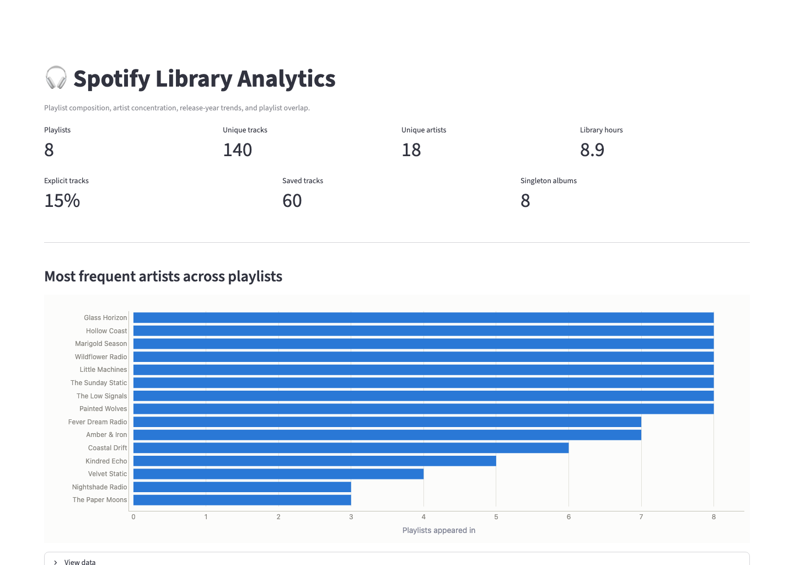
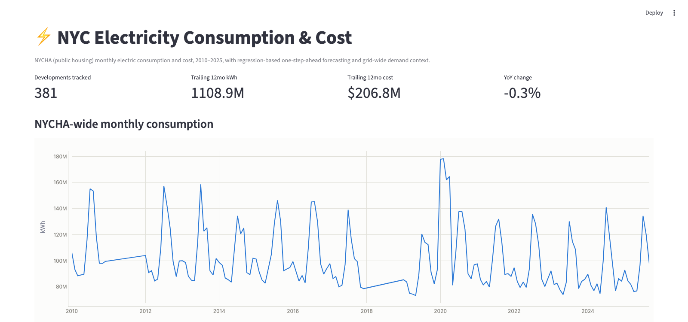

# 🏗️ Data Engineering Portfolio

Welcome to my **public data engineering portfolio**, focused on **example data pipelines**, **practical AI integrations**, and **project structures**.

This repository serves as a **recruiter-friendly showcase**, highlighting:
- ✅ **Live data pipelines** across multiple industries
- ✅ **Explainable AI/ML applications** (no black-box hype)
- ✅ **Production-grade project layouts** — built for **modularity and clarity**
- ✅ 📌 **Focus on process quality** rather than proprietary signals

---

## 🎯 Important Note on Scope

> ⚠️ **Disclaimer**  
> While these projects are **designed to reflect the engineering processes used in professional environments**, they **do not contain proprietary models or signals**.
> - My goal is to **demonstrate architecture, engineering discipline, and analytical rigor**.
> - **Signal logic is simplified** to avoid confidential or firm-specific strategies.
> - These pipelines are **not intended for trading use**, but as **technical capability showcases**.

---

## 📂 Projects

### ✅ [Spotify / Data Build Tool Analytics Pipeline](./spotify-dbt-analytics-pipeline)
- **Live data ingestion** (Spotify user playlist composition, artist concentration, release year trends, playlist overlap, and library structure)
- **DBT Data Marts** (Clean and model information from each Spotify playlist)
- 📊 *Focus*: **music data analytics with DBT and Dagster**

### ✅ [AI-Enhanced Financial Signals Pipeline](./ai-financial-signals-pipeline)
- **Live data ingestion** (stocks, crypto, macroeconomic indicators)
- **Alpha factor engineering** (RSI, Momentum, MACD, SMA)
- **AI meta-signal layer** (XGBoost classifier)
- **Backtesting engine with performance metrics**
- **Diagnostic visualizations**
- 📊 *Focus*: **financial data infrastructure + explainable AI signals**

### ✅ [NYC Electricity Consumption & Cost Pipeline](./nyc-electricity-consumption-pipeline)
- **Live data ingestion** (NYC Open Data NYCHA electric bills + NYISO public grid load)
- **DBT Data Marts** (development/borough/citywide monthly rollups, NYCHA-vs-grid comparison)
- **Regression model suite** (Linear, Ridge, Random Forest, Gradient Boosting, XGBoost) with
  time-based evaluation and a leaderboard
- **AI/data-center demand context** — indexed NYCHA vs. NYC grid load comparison
- 📊 *Focus*: **energy data infrastructure + time-series regression forecasting**

### 🚧 [Machine Learning Algorithm Index](./machine-learning-algorithm-index)
A personal reference index of classical ML and deep learning algorithms, each with a consistent write-up (overview, intuition, math, hyperparameters, advantages/limitations, a hand-verified worked example, and further reading) plus a small runnable script.

- ✅ Linear Regression, Logistic Regression
- ✅ Decision Tree, Random Forest, SVM, K-Nearest Neighbors, Naive Bayes
- ✅ K-Means Clustering, Hierarchical Clustering, Principal Component Analysis
- ✅ Gradient Boosting, XGBoost
- ✅ Neural Networks, CNNs, RNNs, LSTMs, Large Language Models, Retrieval-Augmented Generation

This folder is still local-only (`.gitignore`d) while it's built out — the link above won't
resolve on GitHub until it's further along and gets published.

### ✅ [Cloud Platform Tool Index](./cloud-platform-tool-index)
A reference index mapping data engineering tools and services across AWS, GCP, and Azure — each category gets a side-by-side comparison table plus a "key differences" section on where the "equivalent" services actually diverge (consistency models, pricing shape, managed vs. serverless, API ergonomics).

- ✅ Object Storage, Relational Database (OLTP), Data Warehouse (OLAP)
- ✅ Distributed Batch Processing, Serverless ETL, Workflow Orchestration
- ✅ Streaming/Pub-Sub Messaging, Stream Processing, NoSQL Database
- ✅ Data Catalog & Governance, IAM & Access Control
- ✅ Serverless Compute, Container Orchestration, Secrets Management, Monitoring & Observability

📊 *Focus*: **multi-cloud data engineering service comparison**

### ✅ [Portfolio RAG Pipeline](./portfolio-rag-pipeline)
A working Retrieval-Augmented Generation system built over every README in this repo, plus an evaluation harness that empirically measures how chunk size and retrieval depth (`k`) actually affect retrieval and answer quality — turning a theoretical claim from the ML Algorithm Index's RAG entry into a measured result on real data.

- ✅ Local embeddings (`sentence-transformers`) + DuckDB (`vss`) vector store, one index per chunk-size config
- ✅ Hand-written gold Q&A set (26 questions), scored live against Claude for recall@k, precision@k, and answer correctness across a full 3×3 chunk-size/`k` sweep (234 live calls)
- ✅ Streamlit chat interface over the indexed corpus
- 📈 Headline finding: the best-*precision* config (`chunk_size=1200, k=2`) is not the best-*answer* config — `chunk_size=600, k=4` wins on measured answer correctness (0.962 vs. 0.827), which picking a config by retrieval precision alone would have missed

📊 *Focus*: **RAG system design + empirical retrieval evaluation, not just a chatbot demo**

---

## 🏆 Goals for This Portfolio
✅ Showcase **production-ready pipeline builds**  
✅ Focus on **clarity, modularity, and diagnostics**  
✅ Demonstrate **cross-industry data engineering capability**  

---

## 📬 Contact
**James J. Pecore**  
[LinkedIn](https://www.linkedin.com/in/james-j-pecore) | [GitHub](https://github.com/james-j-pecore)
