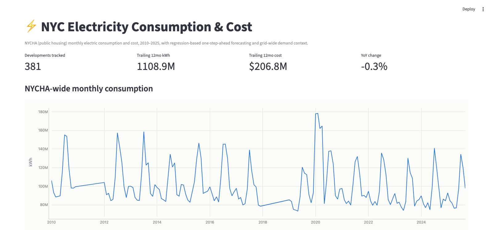
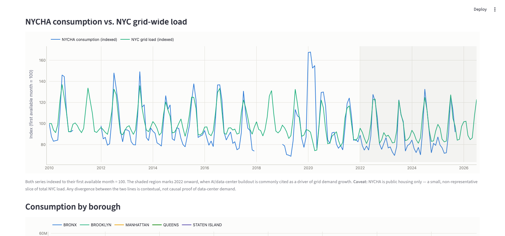
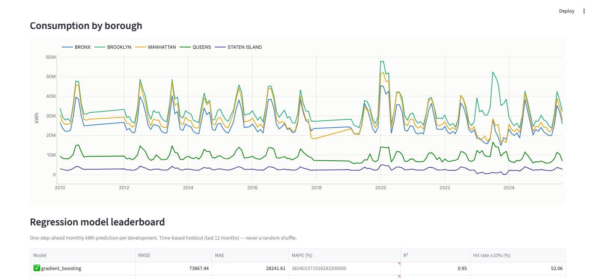
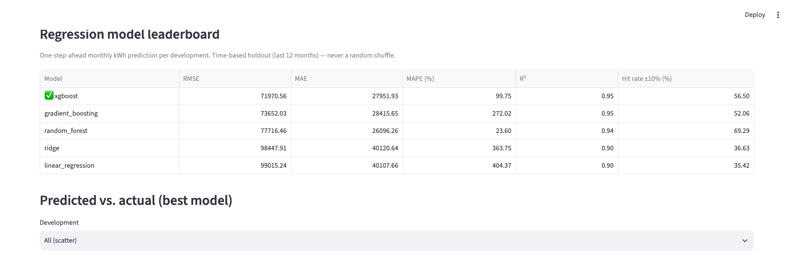
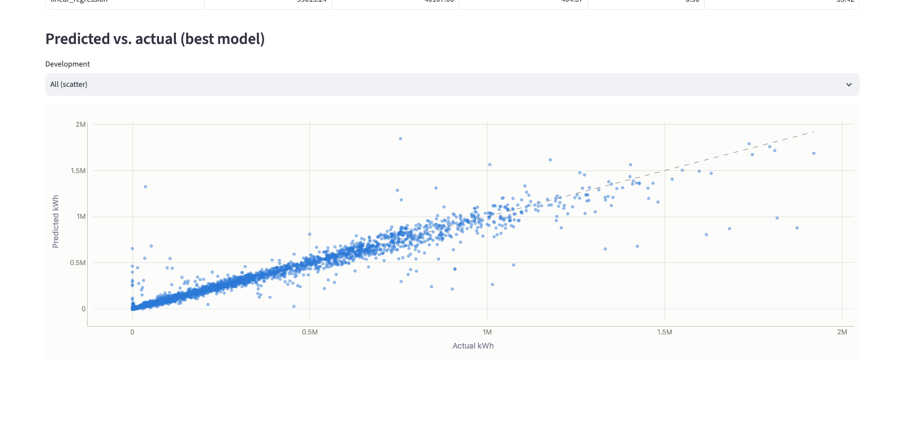

# NYC Electricity Consumption & Cost Pipeline

NYC Open Data + NYISO → DuckDB → dbt → Dagster → Streamlit → regression forecasting.

Pulls monthly electric consumption and cost data for NYC Housing Authority (NYCHA) developments
from NYC Open Data, supplements it with NYISO's public NYC-zone grid load, models both with dbt
into analytics marts, trains a suite of regression models to predict next-month consumption per
development, orchestrates the whole thing with Dagster, and surfaces the results in a Streamlit
dashboard.

**Theme:** track NYC public-housing electricity consumption and cost over time, forecast it with a
compared suite of regression models, and check whether the broader NYC grid's load has diverged
from NYCHA's own trend in recent years — the AI/data-center demand growth story.

**Important framing note:** the source dataset (`jr24-e7cr`) covers **NYCHA public housing
buildings only** — it is not citywide or grid-wide consumption. It will reflect occupancy,
efficiency retrofits, and building-level factors, not data-center demand. That's exactly why the
NYISO grid series is pulled in separately: to give the NYCHA trend genuine outside context rather
than overclaiming a causal story the housing data alone can't support. See "Design decisions" below.

## Dashboard







## Architecture

```
NYC Open Data (Socrata)              NYISO public load archives
     │  jr24-e7cr, $limit/$offset         │  monthly zip, "N.Y.C." zone, 5-min → monthly agg
     ▼                                    ▼
src/nyc_open_data_client.py          src/nyiso_client.py
     │                                    │
     └──────────────┬─────────────────────┘
                     ▼
              src/extract.py + src/load.py    writes raw rows into DuckDB `raw` schema (full refresh)
                     ▼
              data/nyc_electricity.duckdb
                     ▼
              dbt_project/    staging (clean/cast) → intermediate (development/borough/citywide
                               rollups) → marts (feature-ready panel + NYCHA-vs-grid comparison)
                     ▼
              src/models/     time-based train/test split, 5-model regression suite,
                               leaderboard + predictions written back into DuckDB
                     ▼
              analysis/streamlit_app.py   reads marts + model outputs, renders the dashboard

dagster_project/   orchestrates: raw ingestion (Python asset) → dbt build → model training asset
```

## Tech stack

Python · NYC Open Data (Socrata SODA API) · NYISO public data · DuckDB · dbt Core (`dbt-duckdb`) ·
scikit-learn · XGBoost · Dagster (`dagster-dbt`) · Streamlit + Plotly

## Project structure

```
nyc-electricity-consumption-pipeline/
├── src/
│   ├── config.py
│   ├── nyc_open_data_client.py   Socrata paginated GET client
│   ├── nyiso_client.py           downloads monthly load zips, filters to NYC zone, aggregates monthly
│   ├── extract.py
│   ├── load.py
│   └── models/
│       ├── features.py           lag/rolling/seasonal panel features
│       ├── registry.py           the 5-model regression suite
│       └── train.py              time-based split, evaluation, leaderboard + artifact
├── dagster_project/
│   ├── assets.py
│   └── definitions.py
├── dbt_project/
│   └── models/
│       ├── staging/       1:1 clean/cast per source table
│       ├── intermediate/  development/borough/citywide monthly rollups
│       └── marts/         mart_development_monthly, mart_borough_monthly, mart_citywide_vs_grid
├── analysis/
│   └── streamlit_app.py
├── images/       dashboard screenshots used in this README
└── data/
    └── nyc_electricity.duckdb   gitignored, created by the pipeline
```

## Setup

Requires **Python 3.11** (dbt-core's dependency chain isn't yet compatible with 3.14 as of this
writing).

```bash
python3.11 -m venv .venv
source .venv/bin/activate
pip install -r requirements.txt
cp .env.example .env
```

No credentials are required — both source APIs are public. `SOCRATA_APP_TOKEN` in `.env` is
optional and only raises Socrata's anonymous rate-limit ceiling.

## Running the pipeline

**Ingestion** (pulls ~554K NYCHA bill rows and backfills ~190 months of NYISO load — the NYISO
backfill takes a few minutes since it's one zip download per month):

```bash
python -m src.load
```

**dbt** (staging → intermediate → marts, with tests):

```bash
cd dbt_project
dbt build --profiles-dir .
```

**Model training** (5-model regression suite, time-based holdout, writes the leaderboard):

```bash
cd ..
python -m src.models.train
```

**Dagster** (orchestrates all three stages as one asset graph, run from the project root):

```bash
dagster dev
```

Open [localhost:3000](http://localhost:3000), go to **Lineage**, and click **Materialize all** to
run the whole pipeline — ingestion through model training — from the UI.

**Streamlit** (reads marts + model outputs, no source-API calls needed once
`data/nyc_electricity.duckdb` exists):

```bash
streamlit run analysis/streamlit_app.py
```

## Regression modeling

**Target:** `consumption_kwh` for a development in a given month, predicted from information only
available at that month's start (no leakage).

**Features:** 1-month lag, 12-month lag, 3-month rolling mean, sin/cos month-of-year, borough,
dominant rate class, avg billing days.

**Models compared:** Linear Regression, Ridge, Random Forest, Gradient Boosting, XGBoost.

**Evaluation:** time-based split (last 12 months held out — never a random shuffle of a time
series), reporting RMSE, MAE, MAPE, R², and a **hit rate** (% of predictions within 10% of actual)
per model. The best model by RMSE is saved as a joblib artifact and its predictions are written to
`analytics.model_predictions` for the dashboard.

## dbt models

- **Staging** (`stg_nycha__electric_bills`, `stg_nyiso__monthly_load`): clean/cast/rename only.
- **Intermediate**: `int_development_monthly` rolls meter/location-level bills up to one row per
  development per month; `int_borough_monthly` and `int_citywide_monthly` roll further up.
- **Marts**: `mart_development_monthly` (the model training table, with lag/rolling features),
  `mart_borough_monthly` (YoY change per borough), `mart_citywide_vs_grid` (NYCHA vs. NYISO NYC-zone
  load, both indexed to their first available month = 100 — the AI/data-center context chart).

## Design decisions & simplifications

These are intentional choices to keep a portfolio project small and readable, not oversights:

- **NYISO is pulled in specifically to avoid overclaiming.** NYCHA data alone would show only
  public-housing trends; the grid-wide series lets the dashboard show genuine outside context for
  the AI/data-center narrative instead of implying causation the housing data can't support. The
  dashboard caption on that chart says so explicitly.
- **Only monthly aggregates from NYISO are persisted** — the public archives are 5-minute readings,
  but nothing downstream needs sub-monthly grid resolution, so raw 5-minute rows are discarded at
  extract time rather than bloating DuckDB.
- **Full-refresh raw loads** (`CREATE OR REPLACE TABLE`), not incremental/merge — correct at this
  scale and avoids upsert complexity that wouldn't teach anything extra here.
- **A global panel model, not one model per development** — 381 developments is too many to model
  individually with this much history each; borough and rate class are encoded as features instead,
  letting the model share statistical strength across similar developments.
- **Time-based train/test split, not k-fold CV** — shuffling a time series for cross-validation
  leaks future information into training; a single trailing holdout is the honest evaluation here.
- **No Docker, no scheduler** — both APIs are public and the pipeline runs on demand via
  `dagster dev`; neither would demonstrate anything beyond portfolio scope here.

## Known limitations

- NYCHA-only consumption data — see the framing note above. Any AI/data-center narrative rests on
  the NYISO comparison, not on the NYCHA series in isolation.
- No weather/degree-day data — consumption seasonality is captured only via month-of-year encoding,
  not actual temperature, so unusually hot/cold months won't be explained by the model.
- NYISO zone "N.Y.C." approximates the five boroughs but doesn't map 1:1 to NYCHA's footprint.
