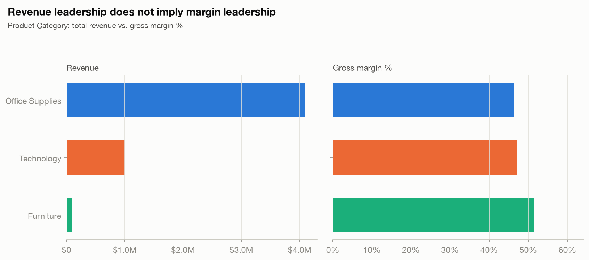
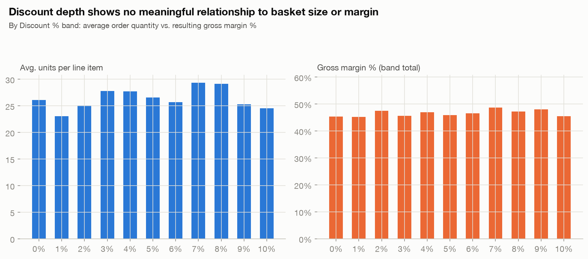
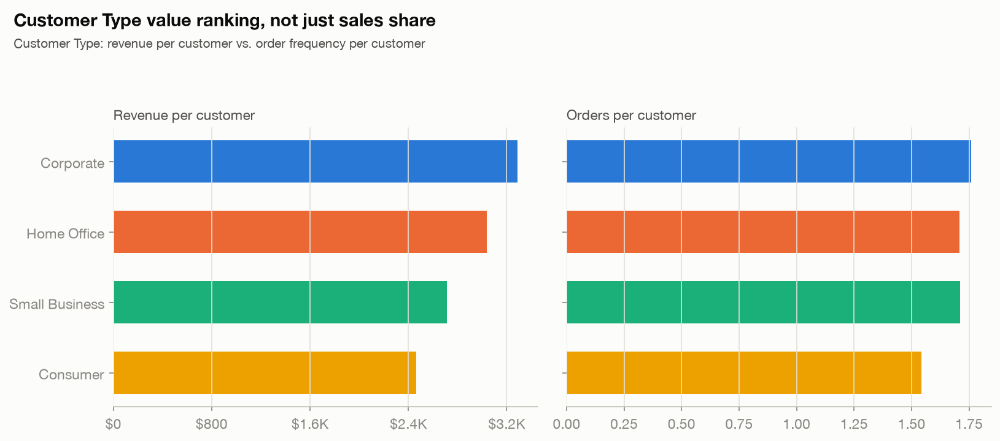
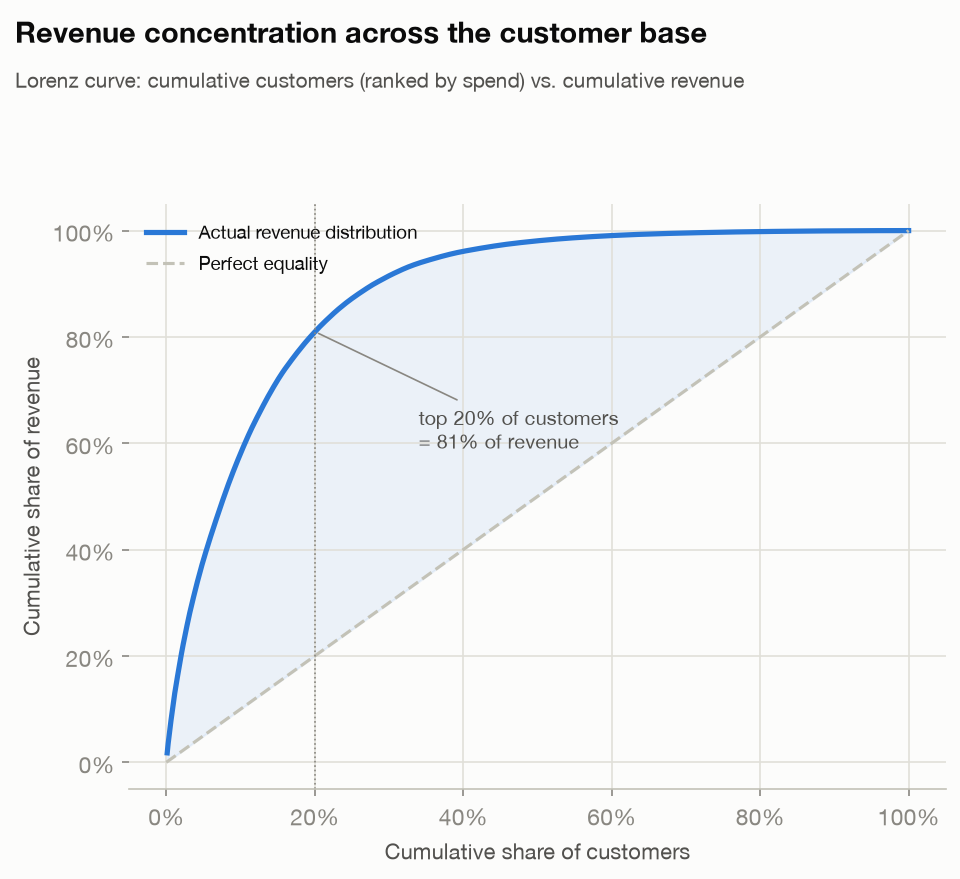
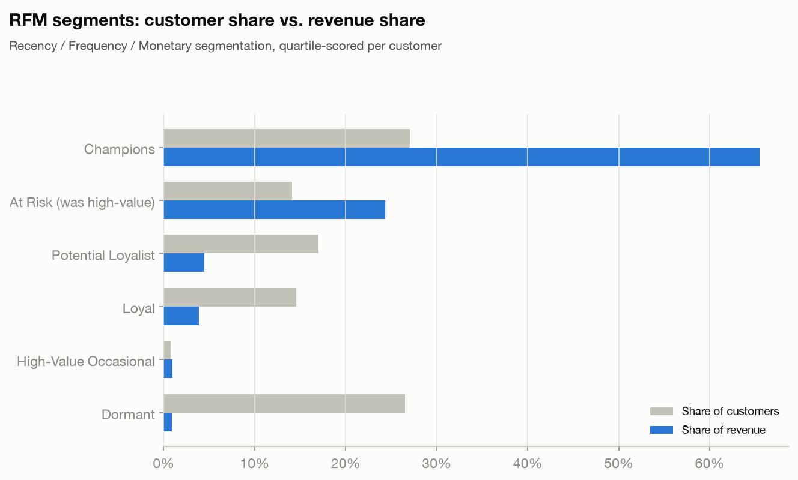
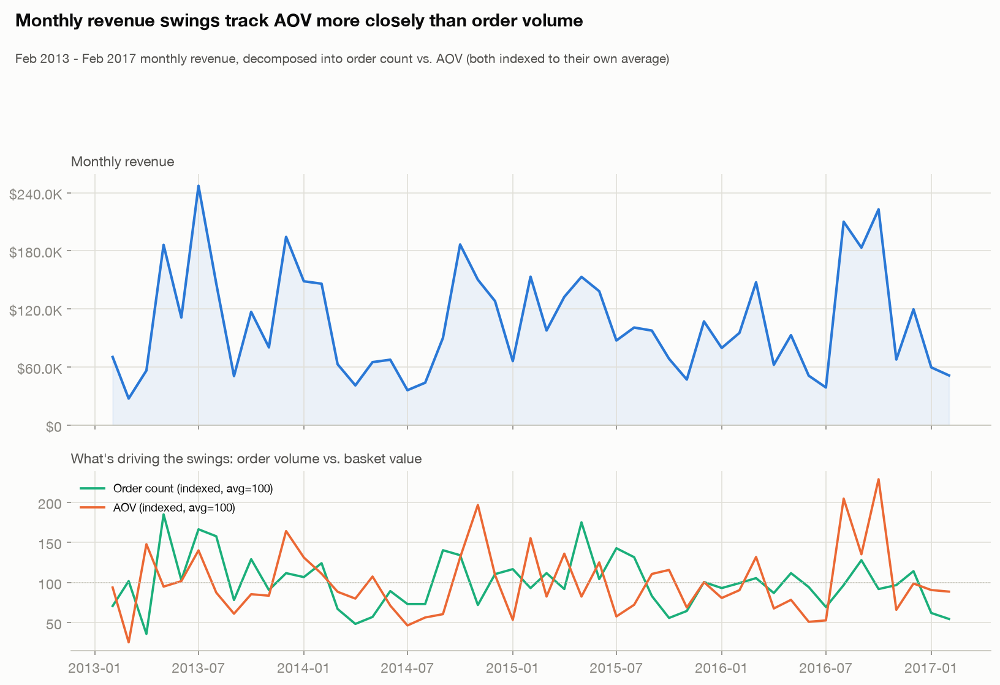
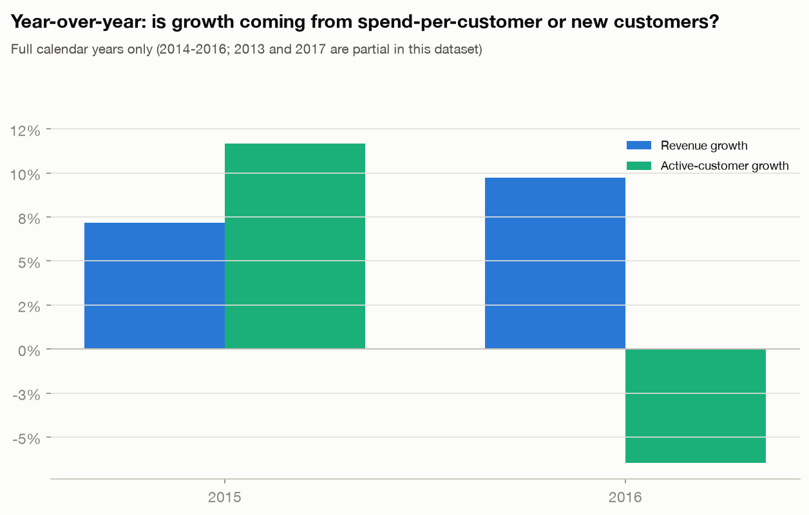
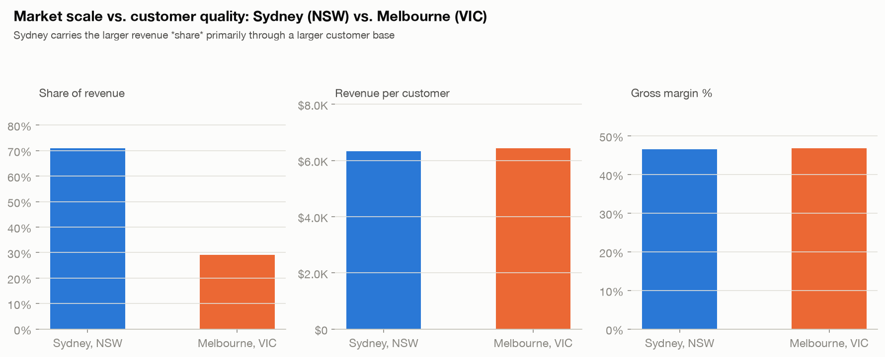
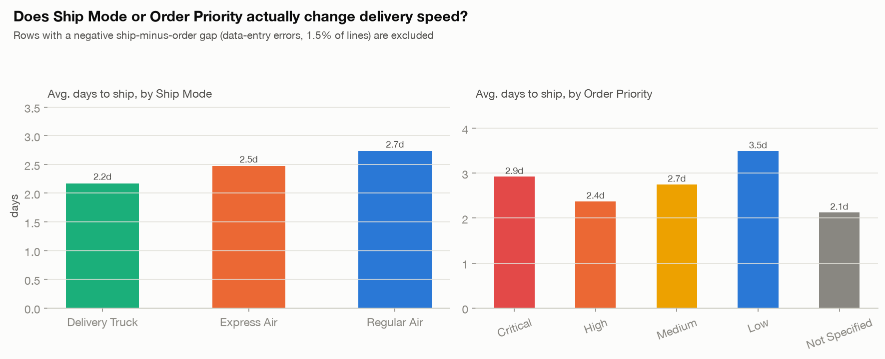
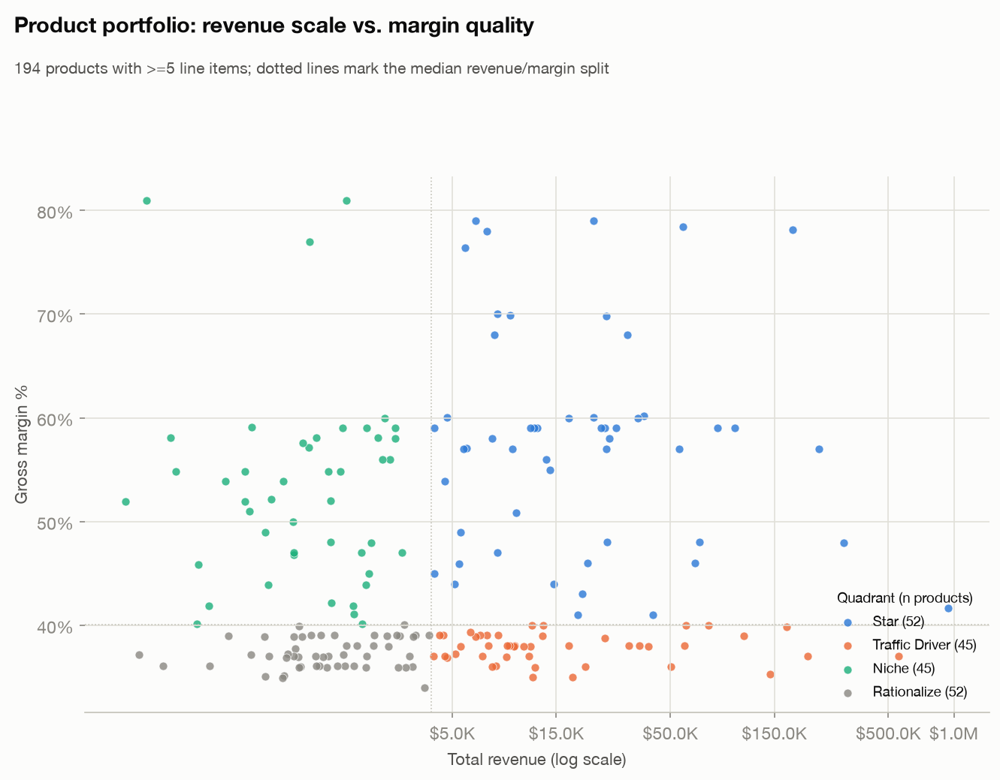

# Retail Sales Analytics

A business-question-driven analysis of a 5,000-line-item retail transaction dataset: revenue
decomposed into profitability, customer value, seasonality, geography, and fulfillment
operations — every chart answers a specific "so what," not just "what."

**Data source:** [Retail Insights — A Comprehensive Sales Dataset](https://www.kaggle.com/datasets/rajneesh231/retail-insights-a-comprehensive-sales-dataset)
(Kaggle, `rajneesh231`). 4,999 clean order line items / 1,366 orders / 788 customers, Feb 2013 –
Feb 2017, a synthetic Australian office-supply retailer (Sydney/NSW and Melbourne/VIC only).

> **This is synthetic data.** The goal of this project is to demonstrate sound analytical
> reasoning — recomputing financial truth from primitives, decomposing a metric into its
> mechanical drivers, separating scale from quality, testing a claim instead of asserting it —
> not to describe a real retailer. Several findings below are *data-quality* findings, which is
> itself the point: a good analyst checks the numbers before building on them.

## Theme

**What actually drives retail profitability — and where do the dataset's own numbers not add up?**
The analysis is organized around three questions:

1. Where does revenue come from (category, product, customer, geography, season)?
2. Is that revenue economically attractive (margin, discount behavior, fulfillment cost)?
3. Where should management focus (which customers, which products, which operational levers)?

## Data quality — recompute, don't trust the supplied aggregates

Before any metric below was computed, the raw CSV was checked column-by-column. Two findings
changed how this project treats the data:

- **The supplied `Sub Total`, `Discount $`, `Order Total`, and `Total` columns do not reconcile
  with `Retail Price × Order Quantity`.** Recomputing revenue from primitives and comparing to
  the supplied `Sub Total` shows a mismatch (>$1) on **4,957 of 4,999 rows (99.2%)** — e.g. the
  very first row implies $6,922.31 of merchandise (`$300.97 × 23`) against a supplied Sub Total
  of $4,533.52. `Profit Margin` (`Retail Price − Cost Price`) is the one aggregate column that
  *is* internally consistent (mismatched on only 15 rows). **Every financial metric in this
  project is therefore recomputed from `Cost Price`, `Retail Price`, `Order Quantity`,
  `Discount %`, and `Shipping Cost` — the supplied Sub Total / Discount $ / Order Total / Total
  columns are never used.** See [`src/data/loader.py`](src/data/loader.py).
- **135 of 257 distinct product names (52.5%) are assigned to more than one `Product Category`**
  across their line items — e.g. "HFX LaserJet 3310 Copier" appears as both `Technology` and
  `Office Supplies`. Category-level rollups below use the category recorded on each line item
  (i.e. a product's revenue can legitimately split across categories); this is flagged rather
  than silently "fixed," since there's no ground truth in the data for which category is correct.
- 75 of 4,999 rows (1.5%) have a `Ship Date` before the `Order Date` — a data-entry error, not a
  real negative lead time. These rows are excluded from every fulfillment-speed metric (ship
  mode, order priority) but kept in revenue-based metrics.
- 1 row has a null `Order Quantity` and is dropped (no reasonable imputation for a missing unit
  count).

## Project structure

```
retail-sales-analytics/
├── src/
│   ├── data/loader.py          download_dataset (kagglehub) + load_clean_data
│   │                           (parsing, recomputed financials, QA flags)
│   ├── metrics/
│   │   ├── profitability.py    category mix, discount-band analysis, product quadrant matrix
│   │   ├── customers.py        segment value, Pareto/Lorenz concentration, RFM
│   │   ├── trends.py           monthly seasonality, revenue-driver decomposition, YoY growth
│   │   ├── geography.py        state/city scale vs. customer quality
│   │   └── fulfillment.py      ship mode / order priority speed, Express Air ROI, account managers
│   └── viz/
│       ├── style.py            validated palette (see dataviz skill), shared matplotlib rcParams
│       └── plotting.py         one function per chart, fixed entity->color maps
├── scripts/run_analysis.py     end-to-end: load -> compute every metric -> render charts ->
│                                write results/headline_numbers.json
├── images/                     10 charts, generated (not committed as "final" — regenerate anytime)
├── results/headline_numbers.json   every number quoted in this README, computed fresh each run
└── requirements.txt
```

## Tech stack

Python 3.11 · pandas / numpy · matplotlib · kagglehub (anonymous public-dataset download, no
Kaggle account needed)

## Setup & running it

```bash
cd retail-sales-analytics
python3.11 -m venv .venv
source .venv/bin/activate
pip install -r requirements.txt
python scripts/run_analysis.py
```

This downloads the dataset via `kagglehub` (cached locally after the first run), recomputes
every metric, regenerates all 10 charts into `images/`, and writes the underlying numbers to
`results/headline_numbers.json` — so every figure quoted below can be independently re-verified.

## Results

### 1. Revenue leadership isn't margin leadership



Office Supplies drives 79.0% of revenue ($4.10M) at 46.4% gross margin. Technology is 19.3%
($999K) at a slightly *better* 47.1% margin. Furniture is only 1.7% of revenue ($87.9K) but the
highest-margin category at 51.4% — small in scale, not in quality. The takeaway for inventory
planning: Office Supplies' revenue dominance comes with average economics, not superior ones: no
category is meaningfully more profitable *per revenue dollar* than any other, so the margin story
here is really about mix and volume, not category quality.

### 2. Discounting shows no measurable payoff



Discount % in this dataset is discrete, 0–10% in whole-percent steps (no deeper discounts exist).
Correlating Discount % against order quantity, revenue, gross profit, and margin % across all
4,999 line items gives **|r| ≤ 0.02 on every measure** (qty: +0.02, revenue: −0.02, profit:
−0.01, margin: −0.01) — statistical noise, not a trend. Average basket size bounces between 23
and 29 units and margin between 45% and 49% with no directional pattern as discount depth
increases. **There is no evidence in this data that deeper discounts buy incremental volume** —
every discount point given away looks like pure margin transfer rather than a demand lever.

### 3. Customer Type: value ranking, not just sales share



| Customer Type | Revenue | Customers | Rev / customer | Orders / customer | Avg. discount | Margin |
|---|---:|---:|---:|---:|---:|---:|
| Corporate | $1.75M (33.8%) | 533 | **$3,289** | 1.76 | 4.8% | **47.7%** |
| Home Office | $1.35M | 445 | $3,039 | 1.71 | **5.5%** | 45.5% |
| Small Business | $1.12M | 412 | $2,714 | 1.71 | 5.0% | 46.3% |
| Consumer | $963K | 391 | $2,462 | 1.54 | 4.9% | 46.7% |

Corporate leads on every value metric, not just raw revenue: highest revenue per customer,
highest order frequency, and the best margin — while receiving a *below-average* discount rate.
Home Office is the inverse case worth flagging: it receives the deepest average discount (5.5%,
the highest of the four segments) yet converts that into the *lowest* margin (45.5%) and
middling revenue per customer — discount spend there isn't buying proportionally more value.

### 4. Revenue is concentrated in a minority of customers



The top 10% of customers (79 of 788) generate **58.2%** of total revenue; the top 20% (158
customers) generate **81.0%**. This is a classic Pareto-skewed base — retention and
account-management investment aimed at a few hundred customers protects the large majority of
revenue, and the "long tail" of ~630 customers contributes the remaining ~19%.

### 5. RFM segmentation: where the concentration actually sits



Recency/Frequency/Monetary, quartile-scored per customer (recency relative to the dataset's own
last order date, since this is historical data, not "today"):

| Segment | Customers | Share of customers | Share of revenue | Avg. recency (days) |
|---|---:|---:|---:|---:|
| Champions | 213 | 27.0% | **65.5%** | 193 |
| At Risk (was high-value) | 111 | 14.1% | 24.3% | 867 |
| Potential Loyalist | 134 | 17.0% | 4.5% | 640 |
| Loyal | 115 | 14.6% | 3.9% | 249 |
| Dormant | 209 | 26.5% | 0.9% | 969 |

Champions (27% of customers) already account for two-thirds of revenue, consistent with the
Pareto result above. The more actionable segment is **"At Risk"**: 111 customers (14.1% of the
base) who historically ordered frequently and spent heavily (avg. 8.1 orders, $11,361 lifetime
revenue — both comparable to Champions) but haven't ordered in an average of 867 days. They
represent 24.3% of historical revenue and are a far higher-value win-back target than the 209
Dormant customers, who were low-value even when active ($216 avg. lifetime revenue).

### 6. Seasonality: revenue swings track basket value more than order count



October is the strongest month (revenue index 138 vs. the all-month average) and April the
weakest (index 68). Decomposing monthly revenue into its two multiplicative components
(`revenue = orders × AOV`) via a log-variance split: **AOV accounts for ~61% of the
month-to-month variance in log revenue, vs. ~40% for order count** (r with revenue: AOV 0.76,
orders 0.61). Basket-value swings — not how many orders come in — are the bigger source of
month-to-month revenue volatility in this dataset.

### 7. Year-over-year: two different growth stories back to back



Using full calendar years only (2013 and 2017 are partial in this dataset's coverage):

- **2015 vs. 2014:** revenue +7.2%, driven by **+11.7% more active customers and +17.3% more
  orders** — AOV actually *fell* 8.7% ($1,983 → $1,812). Classic base-expansion growth.
- **2016 vs. 2015:** revenue +9.7% despite **−6.5% fewer active customers and −32.8% fewer
  orders** — AOV jumped **+63.1%** ($1,812 → $2,956). This is the opposite growth mechanism:
  2016's revenue held up *only* because far fewer orders were each much larger, not because the
  business reached more customers. A revenue-growth headline alone would have missed that 2015
  and 2016 grew for structurally opposite reasons.

### 8. Geography: Sydney's edge is scale, not customer quality



| Market | Revenue share | Customers | Revenue / customer | Margin |
|---|---:|---:|---:|---:|
| Sydney, NSW | 70.9% | 581 | $6,326 | 46.5% |
| Melbourne, VIC | 29.1% | 235 | **$6,429** | **46.8%** |

Sydney's much larger revenue share comes entirely from having 2.5× the customer count — on a
per-customer basis, Melbourne customers are **just as valuable, marginally more so**, on both
revenue and margin. There's no evidence NSW customers are individually "better"; NSW is the
scale market, not the quality market.

### 9. Fulfillment: neither Ship Mode nor Order Priority behaves as labeled



- **Express Air is not meaningfully faster than Regular Air** (2.48 vs. 2.74 days — a 0.26-day,
  ~6-hour difference) **and costs slightly less on average** ($5.26 vs. $5.52). Delivery Truck is
  both the fastest mode (2.17 days) and the cheapest ($5.31). On this data there's no cost/speed
  trade-off to optimize — the "premium" tier doesn't behave like a premium tier.
- **Order Priority shows no monotonic relationship with shipping speed.** "Not Specified" ships
  fastest of all (2.13 days); "Critical" (2.92 days) is *slower* than "High" (2.37 days) and
  close to "Medium" (2.75 days); only "Low" (3.49 days) clearly lags, which is the one piece that
  matches intuition. A priority field that doesn't reliably buy speed for "Critical" orders is
  either not operationally wired up or not informative for routing decisions — worth flagging
  before using it to prioritize anything.

### 10. Product portfolio: revenue scale vs. margin quality



194 products with ≥5 line items, split at the median revenue and median margin into four
quadrants: **52 Stars** (high revenue, high margin), **45 Traffic Drivers** (high revenue, lower
margin), **45 Niche** (lower revenue, high margin), **52 Rationalize** (lower revenue, lower
margin). The single largest product by revenue, the "Cando PC940 Copier" ($942K, 42% margin), is
a Star — but the #2 and #5 products by revenue are both "HFX LaserJet 3310 Copier" line items
(37% margin, Traffic Driver), split across its two inconsistently-recorded categories (see Data
quality above) — a reminder that the category mismatch issue isn't just a footnote, it materially
affects category-level rollups for at least one top-5-revenue product.

### Account managers: portfolio mix explains only part of the spread

Revenue-per-customer varies roughly 2.5× across the 19 account managers ($7,798 down to well
below that), and is only weakly correlated with the share of each manager's book that is
Corporate customers (r = 0.21). Portfolio composition is not the main explanation for the spread
in manager totals — most of the variation would need further investigation (account age mix,
region, tenure) rather than being attributable to "who gets the better accounts."

## Executive summary

Revenue performance here is shaped less by which category or region "wins" and more by *mix* —
product price points, basket value, and a concentrated top tier of customers — than by broad
volume growth. Discounting shows no measurable demand payoff in this data and should not be
assumed to be buying anything. The revenue base is Pareto-concentrated (top 20% of customers =
81% of revenue), and RFM segmentation identifies a specific, high-value win-back opportunity (the
"At Risk" segment, 24% of historical revenue) that a blanket discount campaign would miss.
Two consecutive years grew revenue for opposite structural reasons (broader base in 2015, bigger
baskets in 2016), which a single revenue-growth number would have hidden. Operationally, neither
the shipping-speed premium (Express Air) nor the order-priority system shows the effect its
label implies. And underneath all of it, close to all of the dataset's own supplied subtotal/
total columns don't reconcile with unit economics — the first and most important step in this
analysis was deciding not to trust them.

## Known limitations

- **Synthetic data.** Patterns here (e.g. the discount/demand null result, the Express Air
  finding) describe this generated dataset, not real retail behavior — they're illustrative of
  the *method*, not a claim about how discounting or expedited shipping perform in general.
- **Two markets only.** Geographic analysis is a direct NSW-vs-VIC comparison, not a ranked
  multi-market analysis; conclusions don't generalize to "which state is best."
- **RFM recency is relative to the dataset's last order date** (Feb 2017), not to today — "213
  Champions" describes standing as of that historical snapshot.
- **No causal discount-elasticity model.** The discount finding is a correlation across observed
  line items (r ≈ 0), not an experiment — it rules out a strong *positive* relationship but
  doesn't identify what (if anything) does drive quantity.
- **Category mismatches are flagged, not resolved.** Where a product's line items disagree on
  Product Category, this project reports both as they appear rather than picking one as
  "correct," since the raw data gives no way to arbitrate which is right.
