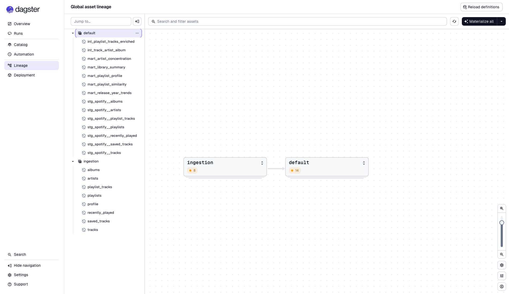
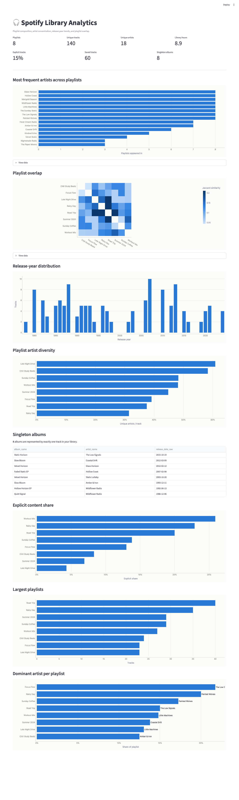

# Spotify Analytics Pipeline

Spotify Web API → DuckDB → dbt → Dagster → Streamlit.

Pulls your playlists, tracks, artists, albums, saved tracks, and recently-played history from the
Spotify API, models them with dbt into analytics marts, orchestrates the whole thing with Dagster,
and surfaces the results in a Streamlit dashboard.

**Theme:** understand your own Spotify library — playlist composition, artist concentration,
release-year trends, playlist overlap, and library structure.

## Architecture

```
Spotify Web API
     │  Authorization Code OAuth, local loopback redirect
     ▼
src/spotify_client.py   auth, pagination, 429 rate-limit retry
     ▼
src/extract.py          pulls profile, playlists, playlist tracks, tracks, artists,
     │                  albums, saved tracks, recently played
     ▼
src/load.py             writes raw rows into DuckDB `raw` schema (full refresh per run)
     ▼
data/spotify.duckdb
     ▼
dbt_project/             staging (clean/cast) → intermediate (joins) → marts (analytics)
     │                   27+ tests: unique, not_null, relationships
     ▼
analysis/streamlit_app.py   reads marts directly, renders the 8 analytics questions below

dagster_project/          orchestrates: raw ingestion (Python asset) → dbt build
                           (one Dagster asset per dbt model, auto-loaded from the dbt manifest)
```

Dagster's asset graph:



## Tech stack

Python · Spotify Web API · DuckDB · dbt Core (`dbt-duckdb`) · Dagster (`dagster-dbt`) · Streamlit
+ Plotly

## Project structure

```
spotify-dbt-analytics-pipeline/
├── src/                    Spotify extraction + DuckDB loading
│   ├── config.py
│   ├── spotify_client.py   OAuth, pagination, rate-limit handling
│   ├── extract.py
│   └── load.py
├── scripts/
│   └── seed_sample_data.py generates a realistic fake library — see "Try it without Spotify auth"
├── dagster_project/
│   ├── assets.py
│   └── definitions.py
├── dbt_project/
│   └── models/
│       ├── staging/        1:1 clean/cast per source table
│       ├── intermediate/   track × artist explode, playlist-track enrichment
│       └── marts/          the 5 analytics marts
├── analysis/
│   └── streamlit_app.py
└── data/
    └── spotify.duckdb      gitignored, created by the pipeline
```

## Setup

Requires **Python 3.11** (dbt-core's dependency chain isn't yet compatible with 3.14 as of this
writing — a 3.14 venv fails on import with a `mashumaro` serialization error).

```bash
python3.11 -m venv .venv
source .venv/bin/activate
pip install -r requirements.txt
cp .env.example .env
```

### Spotify app setup

1. Create an app at the [Spotify Developer Dashboard](https://developer.spotify.com/dashboard).
2. Under **Settings → Redirect URIs**, add exactly `http://127.0.0.1:8080/callback` and save.
   Spotify requires an explicit loopback IP, not the string `localhost`.
3. Under **Settings → User Management**, add the Spotify account you'll log in with. Apps in
   Development Mode 403 every request until the account is explicitly allowlisted there — including
   the developer's own account.
4. The account that **owns** the app needs an active Premium subscription for API access to work at
   all right now (a current Spotify platform requirement, not something this code controls). If you
   don't have that yet, skip to "Try it without Spotify auth" below and come back to real data later.
5. Fill in `SPOTIFY_CLIENT_ID` and `SPOTIFY_CLIENT_SECRET` in `.env` from the app's dashboard page.

### Try it without Spotify auth

Generates a realistic fake library (playlists, tracks, artists, albums with deliberate overlap
across playlists) and loads it through the same `load_all()` path real data goes through, so
everything downstream — dbt, Dagster, Streamlit — treats it identically:

```bash
python -m scripts.seed_sample_data
```

### Or pull your real library

First run opens a browser for Spotify login; the token is cached afterward so you won't need to
log in again until it expires:

```bash
python -m src.load
```

## Running the pipeline

**dbt** (staging → intermediate → marts, with tests):

```bash
cd dbt_project
dbt build --profiles-dir .
```

**Dagster** (orchestrates raw ingestion + the full dbt build as one asset graph):

```bash
dagster dev -m dagster_project.definitions
```

Open [localhost:3000](http://localhost:3000), go to **Lineage**, and click **Materialize all** to
run the whole pipeline — Spotify extraction through dbt marts — from the UI.

**Streamlit** (reads the marts, no Spotify credentials needed once `data/spotify.duckdb` exists):

```bash
streamlit run analysis/streamlit_app.py
```

## Example output



## Analytics questions answered

| Question | Where |
|---|---|
| Which artists appear most frequently across my playlists? | `mart_artist_concentration` |
| Which playlists overlap the most? | `mart_playlist_similarity` (Jaccard similarity) |
| What is the release-year distribution of my library? | `mart_release_year_trends` |
| Which playlists are most diverse by artist? | `mart_playlist_profile.artist_diversity_ratio` |
| Which albums are represented by only one song? | Streamlit query against staging (see app) |
| What share of tracks are explicit? | `mart_library_summary` + per-playlist in `mart_playlist_profile` |
| What are the largest playlists? | `mart_playlist_profile.track_count` |
| Which artists dominate specific playlists? | `mart_playlist_profile.top_artist_name` / `top_artist_share` |

## dbt models

- **Staging** (`stg_spotify__*`): one model per raw source table — playlists, playlist_tracks,
  tracks, artists, albums, saved_tracks, recently_played. Clean/cast/rename only.
- **Intermediate**: `int_track_artist_album` explodes each track's artist list (a track can have
  more than one artist) and joins in album metadata; `int_playlist_tracks_enriched` joins
  playlist-track membership to the primary artist/album.
- **Marts**: `mart_library_summary`, `mart_artist_concentration`, `mart_playlist_similarity`,
  `mart_release_year_trends`, `mart_playlist_profile`.
- 27+ dbt tests across the project: `unique` and `not_null` on every primary key, `relationships`
  tests wherever a foreign key should resolve.

## Design decisions & simplifications

These are intentional choices to keep a portfolio project small and readable, not oversights:

- **Full-refresh raw loads** (`CREATE OR REPLACE TABLE`), not incremental/merge — correct at
  personal-library scale, and avoids upsert complexity that wouldn't teach anything extra here.
- **No Docker** — dbt, Dagster, and DuckDB are trivial to `pip install`; a container wouldn't
  demonstrate anything Docker-specific for this project's scope.
- **No scheduler wired up** — the first run needs an interactive browser OAuth step, so a
  cron/Dagster schedule isn't meaningful for a portfolio demo. The Dagster job runs on demand via
  `dagster dev`.
- **Raw layer stores JSON blobs** (`id` + full API response as a DuckDB `JSON` column), flattened
  in dbt staging models rather than in Python — keeps `load.py` generic and puts all transformation
  logic in one place (dbt), which is also where its tests and docs live.
- **Track/album metadata reused from embedded API responses** — Spotify's playlist/saved-tracks/
  recently-played endpoints already return full track objects (including album), so no extra API
  calls are made for those; only artists are batch-fetched separately (via `GET /artists`), since
  they're only embedded as simplified refs without genres/popularity/followers.

## Known limitations

- Personal library size only — no volume/scale story, by design.
- First run requires a one-time interactive browser OAuth step; can't be run fully headless.
- Spotify's API access rules are visibly in flux for new/development-mode apps (see Setup above);
  the sample-data path exists specifically so the rest of the pipeline isn't blocked by that.
