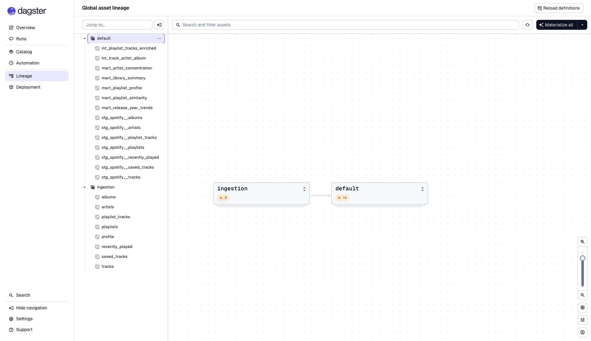
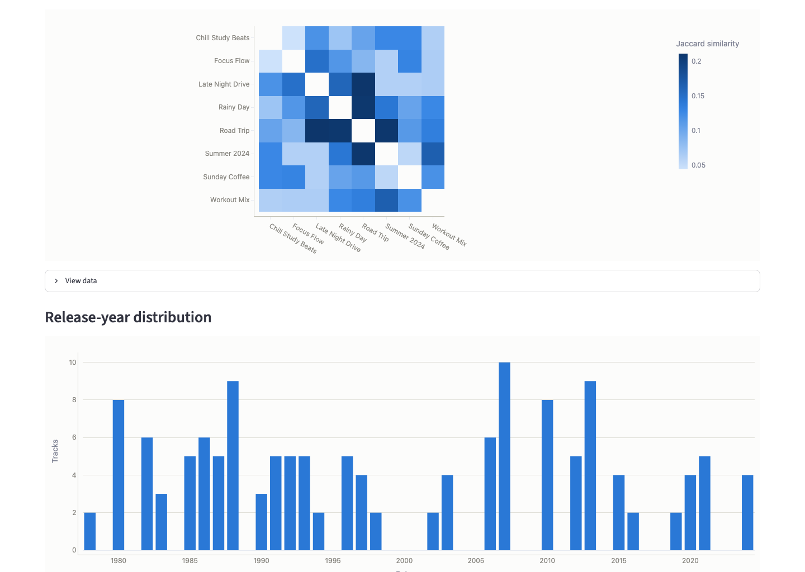
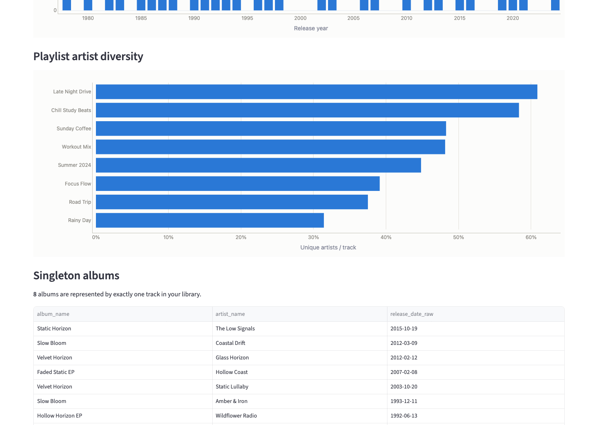
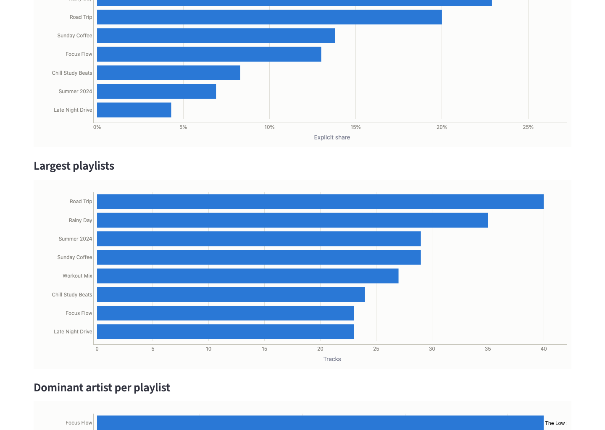

# Spotify Analytics Pipeline

Spotify Web API → DuckDB → dbt → Dagster → Streamlit.

Pulls your playlists, tracks, artists, albums, saved tracks, and recently-played history from the
Spotify API, models them with dbt into analytics marts, orchestrates the whole thing with Dagster,
and surfaces the results in a Streamlit dashboard.

**Theme:** understand your own Spotify library — playlist composition, artist concentration,
release-year trends, playlist overlap, and library structure.

## Architecture

```
Spotify Web API
     │  Authorization Code OAuth, local loopback redirect
     ▼
src/spotify_client.py   auth, pagination, 429 rate-limit retry
     ▼
src/extract.py          pulls profile, playlists, playlist tracks, tracks, artists,
     │                  albums, saved tracks, recently played
     ▼
src/load.py             writes raw rows into DuckDB `raw` schema (full refresh per run)
     ▼
data/spotify.duckdb
     ▼
dbt_project/             staging (clean/cast) → intermediate (joins) → marts (analytics)
     │                   27+ tests: unique, not_null, relationships
     ▼
analysis/streamlit_app.py   reads marts directly, renders the 8 analytics questions below

dagster_project/          orchestrates: raw ingestion (Python asset) → dbt build
                           (one Dagster asset per dbt model, auto-loaded from the dbt manifest)
```

Dagster's asset graph:



## Tech stack

Python · Spotify Web API · DuckDB · dbt Core (`dbt-duckdb`) · Dagster (`dagster-dbt`) · Streamlit
+ Plotly

## Project structure

```
spotify-dbt-analytics-pipeline/
├── src/                    Spotify extraction + DuckDB loading
│   ├── config.py
│   ├── spotify_client.py   OAuth, pagination, rate-limit handling
│   ├── extract.py
│   └── load.py
├── scripts/
│   └── seed_sample_data.py generates a realistic fake library — see "Try it without Spotify auth"
├── dagster_project/
│   ├── assets.py
│   └── definitions.py
├── dbt_project/
│   └── models/
│       ├── staging/        1:1 clean/cast per source table
│       ├── intermediate/   track × artist explode, playlist-track enrichment
│       └── marts/          the 5 analytics marts
├── analysis/
│   └── streamlit_app.py
└── data/
    └── spotify.duckdb      gitignored, created by the pipeline
```

## Setup

Requires **Python 3.11** (dbt-core's dependency chain isn't yet compatible with 3.14 as of this
writing — a 3.14 venv fails on import with a `mashumaro` serialization error).

```bash
python3.11 -m venv .venv
source .venv/bin/activate
pip install -r requirements.txt
cp .env.example .env
```

### Spotify app setup

1. Create an app at the [Spotify Developer Dashboard](https://developer.spotify.com/dashboard).
2. Under **Settings → Redirect URIs**, add exactly `http://127.0.0.1:8080/callback` and save.
   Spotify requires an explicit loopback IP, not the string `localhost`.
3. Under **Settings → User Management**, add the Spotify account you'll log in with. Apps in
   Development Mode 403 every request until the account is explicitly allowlisted there — including
   the developer's own account.
4. The account that **owns** the app needs an active Premium subscription for API access to work at
   all right now (a current Spotify platform requirement, not something this code controls). If you
   don't have that yet, skip to "Try it without Spotify auth" below and come back to real data later.
5. Fill in `SPOTIFY_CLIENT_ID` and `SPOTIFY_CLIENT_SECRET` in `.env` from the app's dashboard page.

### Try it without Spotify auth

Generates a realistic fake library (playlists, tracks, artists, albums with deliberate overlap
across playlists) and loads it through the same `load_all()` path real data goes through, so
everything downstream — dbt, Dagster, Streamlit — treats it identically:

```bash
python -m scripts.seed_sample_data
```

### Or pull your real library

First run opens a browser for Spotify login; the token is cached afterward so you won't need to
log in again until it expires:

```bash
python -m src.load
```

## Running the pipeline

**dbt** (staging → intermediate → marts, with tests):

```bash
cd dbt_project
dbt build --profiles-dir .
```

**Dagster** (orchestrates raw ingestion + the full dbt build as one asset graph, run from the project root):

```bash
cd ..
dagster dev -m dagster_project.definitions
```

Open [localhost:3000](http://localhost:3000), go to **Lineage**, and click **Materialize all** to
run the whole pipeline — Spotify extraction through dbt marts — from the UI.

**Streamlit** (reads the marts, no Spotify credentials needed once `data/spotify.duckdb` exists):

```bash
streamlit run analysis/streamlit_app.py
```

## Example output








## Analytics questions answered

| Question | Where |
|---|---|
| Which artists appear most frequently across my playlists? | `mart_artist_concentration` |
| Which playlists overlap the most? | `mart_playlist_similarity` (Jaccard similarity) |
| What is the release-year distribution of my library? | `mart_release_year_trends` |
| Which playlists are most diverse by artist? | `mart_playlist_profile.artist_diversity_ratio` |
| Which albums are represented by only one song? | Streamlit query against staging (see app) |
| What share of tracks are explicit? | `mart_library_summary` + per-playlist in `mart_playlist_profile` |
| What are the largest playlists? | `mart_playlist_profile.track_count` |
| Which artists dominate specific playlists? | `mart_playlist_profile.top_artist_name` / `top_artist_share` |

## How dbt works

dbt (data build tool) isn't a data-movement tool — it never talks to the Spotify API and doesn't
write a single row into `raw`. That's `src/extract.py` and `src/load.py`'s job. dbt's job starts
*after* data is already sitting in DuckDB: it's the **T** in ELT, turning raw tables into modeled,
tested, documented analytics tables using nothing but `SELECT` statements. A dbt "model" is just a
`.sql` file containing one `SELECT` — dbt wraps it in the right `CREATE VIEW`/`CREATE TABLE` DDL and
runs it. You never write `CREATE TABLE` yourself.

### `ref()` and `source()`: the dependency graph is inferred, not declared

Every model in this project reads from another model or a raw source through one of two Jinja
macros instead of a hardcoded table name:

```sql
-- stg_spotify__tracks.sql — reads a raw table
select * from {{ source('raw', 'tracks') }}
```

```sql
-- int_track_artist_album.sql — reads another dbt model
select * from {{ ref('stg_spotify__tracks') }}
```

`source()` points at a raw table dbt doesn't manage (declared once in `_sources.yml`); `ref()`
points at another model by name. At compile time, dbt scans every model file, collects all the
`ref()`/`source()` calls, and builds a **directed acyclic graph (DAG)** from the result — nobody
writes down "run staging before intermediate before marts" anywhere; it falls out of which models
call `ref()` on which other models. `dbt build` topologically sorts that graph and runs models in
dependency order, in parallel wherever the graph allows it. Because `ref()` is a function call
rather than a literal `schema.table` string, dbt can also rewrite which physical schema each call
resolves to at compile time (dev vs. prod, or in this project, whatever `+schema:` is set to in
`dbt_project.yml`) without touching a single model's SQL.

### Three layers: staging → intermediate → marts

```
raw.tracks (JSON blob)
     │  stg_spotify__tracks.sql — extract JSON fields, cast types
     ▼
stg_spotify__tracks
     │  int_track_artist_album.sql — unnest artist array, join album + artist
     ▼
int_track_artist_album
     │  int_playlist_tracks_enriched.sql — join playlist membership, filter to primary artist
     ▼
int_playlist_tracks_enriched
     │  mart_playlist_profile.sql — aggregate to one row per playlist
     ▼
mart_playlist_profile   ← Streamlit queries this directly
```

Each layer exists for a different reason, not just as folder convention:

- **Staging** (`stg_spotify__*`) is a strict 1:1 wrapper per raw source table — extract JSON fields,
  cast types, rename columns. No joins, no business logic. This is the *only* place that knows the
  raw Spotify API's shape (e.g. `data ->> 'id'`, `data -> 'artists' -> 0 ->> 'id'`), so if Spotify
  changes a field name tomorrow, exactly one file per affected source needs to change — nothing
  downstream needs to know.
- **Intermediate** models hold joins and modeling decisions that don't belong to any single source
  and aren't yet a final answer. `int_track_artist_album` decides how to handle a track having
  multiple artists (`unnest` the artist array into one row per track-artist pair) exactly once; every
  mart built on top inherits that decision instead of re-deriving it. `int_playlist_tracks_enriched`
  then filters back down to `is_primary_artist` specifically so the playlist-track join stays 1:1 —
  otherwise a two-artist track would silently duplicate its playlist row.
- **Marts** (`mart_*`) are the final, consumption-ready shape — one concept per mart, aggregated and
  named for what a dashboard or analyst actually asks for. `mart_playlist_profile` is one row per
  playlist because "one row per playlist" is the shape the Streamlit app and a human both want, not
  because that's how the data naturally landed from the API.

The practical payoff: when a number in a mart looks wrong, you trace it backward one layer at a
time — mart → intermediate → staging — instead of untangling one giant query that does extraction,
joining, and aggregation all at once.

### Materialization: a config choice, not a code change

```yaml
# dbt_project.yml
models:
  spotify_analytics:
    staging:      { +materialized: view }   # recompute on every query, no storage
    intermediate: { +materialized: view }
    marts:        { +materialized: table }  # computed once at build time, persisted
```

"Materialization" is how dbt turns a `SELECT` into an actual database object, and it's set entirely
through config — the model's SQL never changes whether it becomes a view or a table. Staging and
intermediate models are views here: they're cheap to keep as views (no duplicated storage), and
because DuckDB recomputes a view's query on every read, they always reflect the current
transformation logic against the latest raw data with nothing to go stale. Marts are tables: they
get computed once per `dbt build` and persisted, because Streamlit queries them directly and
repeatedly — recomputing the full staging → intermediate → marts chain on every dashboard load would
redo the same joins and aggregations for no benefit.

### Tests are code, checked into git, not tribal knowledge

```yaml
# _staging.yml
- name: track_id
  tests:
    - not_null
    - relationships:
        arguments:
          to: ref('stg_spotify__tracks')
          field: track_id
```

`unique`, `not_null`, and `relationships` aren't documentation comments — each one compiles to a
real SQL query dbt runs after `build` and fails on. `unique` becomes a `group by … having count(*) >
1`; `relationships` becomes a `left join … where right.key is null`, which is how referential
integrity gets checked in an analytical warehouse that (unlike an OLTP database) doesn't enforce
foreign keys at all. Note that the test itself calls `ref()` — so a `relationships` test on
`playlist_track_id` pointing at `stg_spotify__tracks` is *itself* a node in the DAG, and dbt knows to
wait until `stg_spotify__tracks` has actually built before running it. This project has 27+ such
tests: `unique` + `not_null` on every primary key, `relationships` wherever a foreign key should
resolve.

### The YAML is also the documentation

`_sources.yml`, `_staging.yml`, and `_marts.yml` do double duty: the same `description:` fields that
sit next to each test feed `dbt docs generate`, which produces a browsable site with the full
lineage graph and column-level docs — generated directly from the files that define the tests, so
the documentation can't drift out of sync with what's actually being checked, and it's versioned in
git alongside the models themselves rather than living in a separate wiki.

### Why dbt instead of a folder of `.sql` scripts

- **The DAG replaces manual ordering.** Nobody maintains a run-order list; it's derived from `ref()`
  calls and recalculated every time a model is added or changed.
- **Tests replace "does this number look right" by eye.** Data-quality assumptions are declared once
  in YAML and checked automatically on every build, not verified ad hoc after something looks off in
  Streamlit.
- **One `dbt build` runs the whole thing correctly.** Staging, intermediate, and marts build in
  dependency order with tests interleaved — a single command, not a script that calls other scripts
  in a hand-maintained sequence.
- **Dagster doesn't need to know the dbt DAG separately.** `dagster-dbt` reads dbt's own
  `manifest.json` (produced by the same compile step that resolves every `ref()`/`source()`) and
  generates one Dagster asset per dbt model automatically — the orchestration graph in the Dagster UI
  *is* the dbt DAG, not a second copy of it that could drift out of sync.

### This project's models

- **Staging** (`stg_spotify__*`): one model per raw source table — playlists, playlist_tracks,
  tracks, artists, albums, saved_tracks, recently_played. Clean/cast/rename only.
- **Intermediate**: `int_track_artist_album` explodes each track's artist list (a track can have
  more than one artist) and joins in album metadata; `int_playlist_tracks_enriched` joins
  playlist-track membership to the primary artist/album.
- **Marts**: `mart_library_summary`, `mart_artist_concentration`, `mart_playlist_similarity`,
  `mart_release_year_trends`, `mart_playlist_profile`.
- 27+ dbt tests across the project: `unique` and `not_null` on every primary key, `relationships`
  tests wherever a foreign key should resolve.

## Design decisions & simplifications

These are intentional choices to keep a portfolio project small and readable, not oversights:

- **Full-refresh raw loads** (`CREATE OR REPLACE TABLE`), not incremental/merge — correct at
  personal-library scale, and avoids upsert complexity that wouldn't teach anything extra here.
- **No Docker** — dbt, Dagster, and DuckDB are trivial to `pip install`; a container wouldn't
  demonstrate anything Docker-specific for this project's scope.
- **No scheduler wired up** — the first run needs an interactive browser OAuth step, so a
  cron/Dagster schedule isn't meaningful for a portfolio demo. The Dagster job runs on demand via
  `dagster dev`.
- **Raw layer stores JSON blobs** (`id` + full API response as a DuckDB `JSON` column), flattened
  in dbt staging models rather than in Python — keeps `load.py` generic and puts all transformation
  logic in one place (dbt), which is also where its tests and docs live.
- **Track/album metadata reused from embedded API responses** — Spotify's playlist/saved-tracks/
  recently-played endpoints already return full track objects (including album), so no extra API
  calls are made for those; only artists are batch-fetched separately (via `GET /artists`), since
  they're only embedded as simplified refs without genres/popularity/followers.

## Known limitations

- Personal library size only — no volume/scale story, by design.
- First run requires a one-time interactive browser OAuth step; can't be run fully headless.
- Spotify's API access rules are visibly in flux for new/development-mode apps (see Setup above);
  the sample-data path exists specifically so the rest of the pipeline isn't blocked by that.
